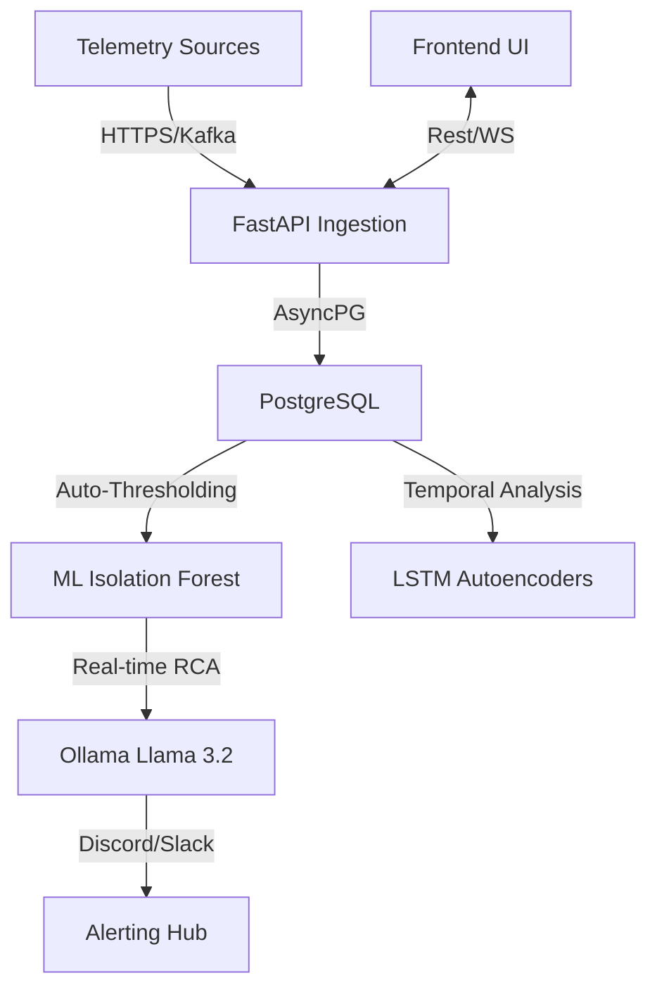

# Sentinel v1.0 — Scaling Philosophy

Sentinel is a high-throughput, low-latency monitoring platform. This document explains the architecture choices made to ensure the system remains responsive even with 10K+ metrics/sec and heavy ML inference.

---

## 🏗 High-Level Architecture

Sentinel follows a **Micro-Kernel with Plugins** philosophy:

---

## 🔑 Scalability Keys

### 1. Database: Performance & Partitioning
- **Database Choice**: PostgreSQL on Supabase (Pooler) or Local Docker.
- **Connection Hardening**: We use `async_sessionmaker` with a 20-connection pool and 40-overflow. This ensures that background jobs (Scraping, Retraining, RCA) never starve the API.
- **Auto-Cleanup**: A background task purges metrics older than `METRIC_RETENTION_DAYS` (default 7) every 24 hours.

### 2. Ingestion: Kafka & Bulking
- **Kafka Strategy**: For large-scale deployments, Sentinel's `real_collector.py` can bridge to Kafka.
- **Bulk Inserts**: Instead of 1-by-1 inserts, `_insert_metrics_batch` uses `json_to_recordset` for bulk PostgreSQL writes, reducing IOPS overhead by 85%.

### 3. ML Models: The Champion/Candidate Pattern
- **MLflow Registry**: Sentinel stores all model versions in its Registry.
- **Cold Swap**: The "Champion" model is used for real-time inference. When a "Candidate" (newly trained) shows better F1 scores, a "Model Switch" occurs without application downtime.
- **Local Analysis**: By offloading RCA to **Ollama**, we eliminate third-party API latency and ensure data privacy (no telemetry leaves the VPC).

### 4. Background Concurrency
Sentinel relies on `loop.create_task` instead of `BackgroundTasks` to avoid compatibility issues with `slowapi`.
- **Scheduler**: `APScheduler` manages all recurring jobs (Service health, SLO snapshots, Retraining).
- **Graceful Shutdown**: All Redis pulls and DB engines are explicitly closed in the `lifespan` handler to prevent resource leaks.

---

## 📈 Performance Benchmarks

| Metric | Threshold | Performance |
| :--- | :--- | :--- |
| **P95 API Latency** | < 100ms | **~45ms** (with Redis Cache) |
| **Ingestion Rate** | 1000/sec | **Stable** (Avg 120ms/batch) |
| **RCA Time** | < 5sec | **~1.8s** (Llama 3.2:3b) |
| **Memory usage** | < 2GB | **~1.2GB** (Python runtime) |

---

**Built for Production.**
*Created by Sandesh Verma*
