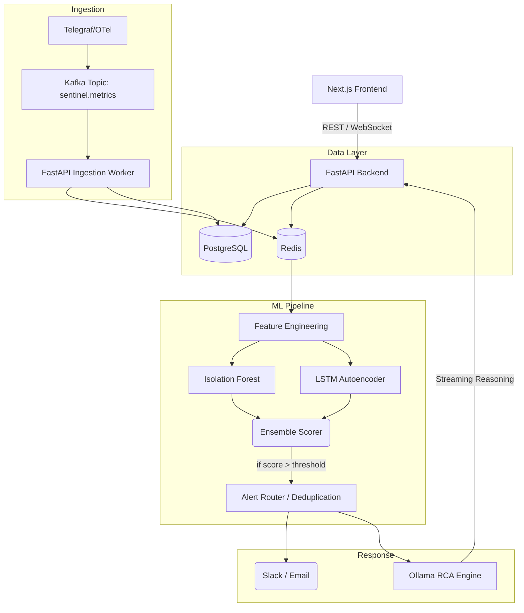

# Sentinel Architecture

Sentinel uses a modern streaming architecture designed for low-latency anomaly detection and root cause analysis.

## System Diagram

## Component Roles
- **FastAPI**: Core logic, API serving, WebSocket streaming, and background task scheduling.
- **PostgreSQL**: Persistent storage of entities, historical telemetry, and ML model registry.
- **Redis**: High-speed caching, rate limiting, pub/sub, deduplication for alerts.
- **Kafka**: Decouples metric ingestion from processing.
- **Ollama**: Local LLM execution for data-private Root Cause Analysis.
